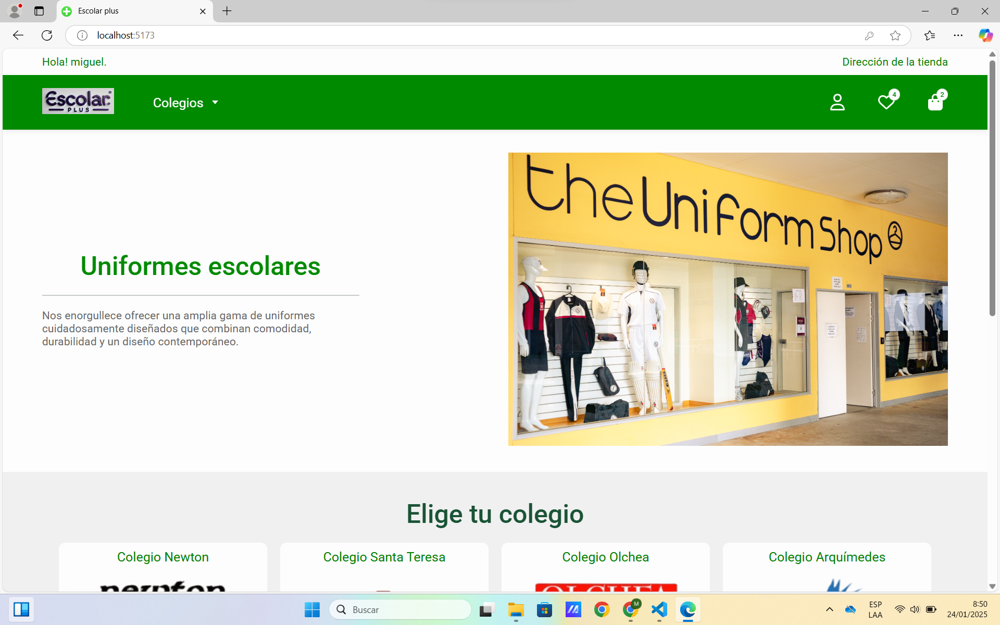
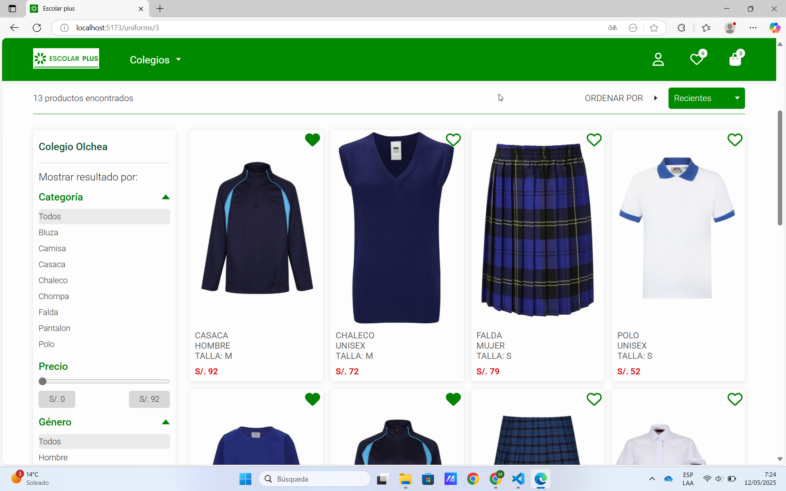
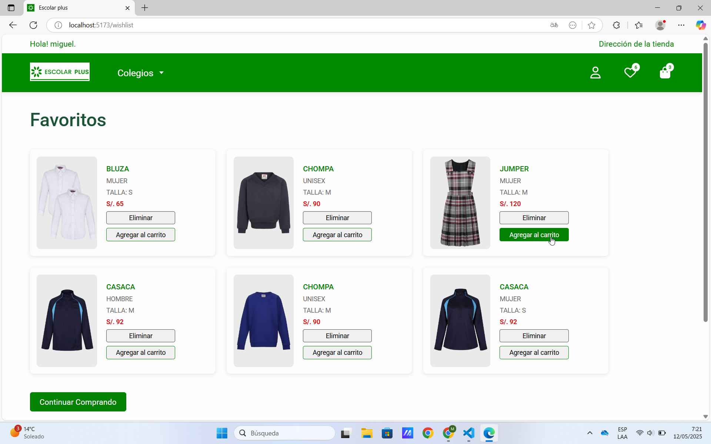
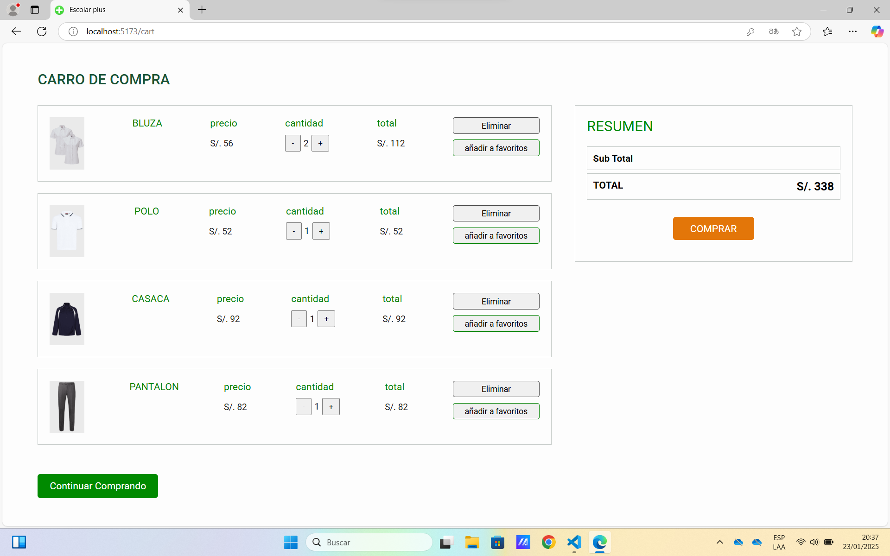

# E-commerce

Este es un proyecto de e-commerce desarrollado con **React** para el frontend y **Java** en el backend. La base de datos está implementada usando **MySql**. Este proyecto muestra las principales funcionalidades de un e-commerce, filtrado, carrito de compras, lista de deseos y más.

---

## Características Principales

### Frontend:
- **React**: Componentes funcionales, hooks (useState, useEffect, useNavigate).
- **React Router**: Implementación de rutas dinámicas y navegación.
- **Redux**: Gestión global del estado de la aplicación.
- **CSS**: Estilos responsivos utilizando Flexbox y Grid.
- **Integración con APIs RESTful** mediante axios.

### Backend:
- **Java con Spring Boot**: Creación de APIs REST para manejar las operaciones del e-commerce.
- **Seguridad**: Implementación de autenticación y autorización mediante tokens JWT.
- **Roles y Permisos**: Uso de roles como ROLE_ADMIN y ROLE_USER para acceso seguro a las funcionalidades.
- **Base de Datos**: Uso de MySQL como sistema de base de datos relacional.
- **Spring Data JPA**: Gestión de entidades y operaciones CRUD con un enfoque basado en repositorios.
- **Validación de datos**: Uso de DTOs y validaciones con anotaciones.
- **Arquitectura MVC**: Separación clara de responsabilidades entre modelos, vistas y controladores.

### Otros:
- Diseño basado en componentes reutilizables y buenas prácticas de programación.
- **Metodología Agile**: Gestión del proyecto dividiéndolo en etapas claras y manejables.

---

## Capturas de Pantalla

1. **Página principal**:
   - Muestra productos destacados y categorías.
      

2. **Sistema de filtros**:
   - Filtra por categoría, precio.
      

3. **Sistema de favoritos**:
   - Lista de favoritos.
      

4. **Carrito de compras**:
   - Agrega, elimina o modifica productos en tiempo real.
      

---

## Tecnologías Usadas

- **Frontend**:
  - React
  - Redux Toolkit
  - React Router
  - CSS Modules

- **Backend**:
  - Java (Spring Boot)
  - Hibernate
  - MySql

---

## Cómo Ejecutar el Proyecto Localmente

### Requisitos Previos

- Node.js (v16 o superior)
- JDK 17
- IntelliJ IDEA o cualquier editor compatible con Java

### Pasos

#### 1. Clonar el repositorio

```bash
# Clonar este proyecto en tu máquina local
$ git clone https://github.com/MiguelJarecca/App-cole-uniform.git

# Navegar al directorio del proyecto
$ cd App-cole-uniform
```

#### 2. Configuración del Frontend

```bash
# Navegar al directorio del frontend
$ cd client

# Instalar dependencias
$ npm install

# Ejecutar la aplicación
$ npm start
```

La aplicación estará disponible en: `http://localhost:5173`

#### 3. Configuración del Backend

1. Abrir el proyecto en tu IDE (Visual Studio Code u otro).
2. Ejecutar la clase principal del proyecto `Application.java`.
3. El backend estará disponible en: `http://localhost:8080`

---

## Créditos

Desarrollado por **Miguel Jarecca** como parte de un proyecto de aprendizaje en React y Java.

---

## Contacto

Para más información o preguntas:
- **Email**: miguel.jarecca@gmail.com
- **LinkedIn**: [Miguel Jarecca - LinkedIn](https://www.linkedin.com/in/migueljarecca/)
- **GitHub**: [Miguel Jarecca - GitHub](https://github.com/MiguelJarecca)
- **Portafolio**: [Miguel Jarecca - Portafolio](https://migueljarecca.github.io/portafolio-miguel/)

---

¡Gracias por revisar mi proyecto! 😊
